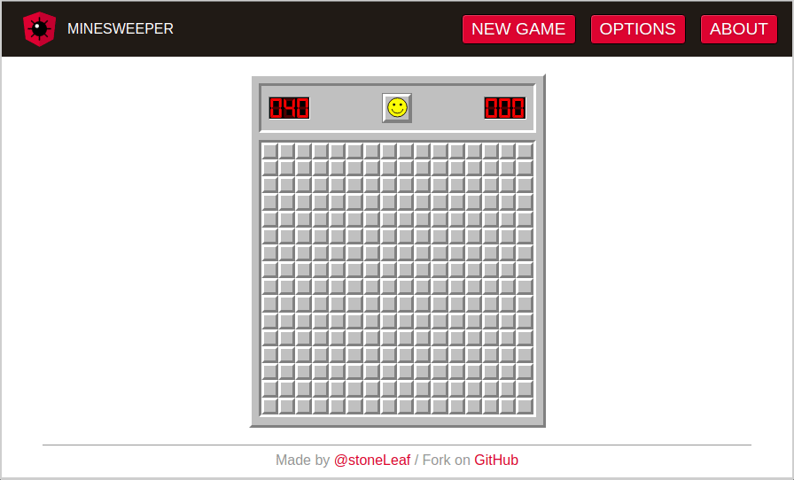

# minesweeper-angular

 

A [Minesweeper](https://en.wikipedia.org/wiki/Minesweeper_(video_game)) game built with [Angular](https://angular.io/). The look and feel is a tribute to the original Minesweeper for Windows.

**[Live demo on StackBlitz](https://stackblitz.com/edit/minesweeper-angular)**

## Preview

## Setup

This project requires [Node.js](https://nodejs.org/), [npm](https://www.npmjs.com/get-npm) and preferably a global install of the [Angular CLI](https://cli.angular.io/). You can then follow these steps:

- clone the repository
- `npm install` to set up the required dependencies
- `ng serve` to run a dev server

## License

This project codebase is under the [MIT license](LICENSE).
The logo is based on the [official Angular logo](https://angular.io/presskit) which is under [CC BY 4.0](https://creativecommons.org/licenses/by/4.0/).
All other graphics are by me and also under [CC BY 4.0](https://creativecommons.org/licenses/by/4.0/).